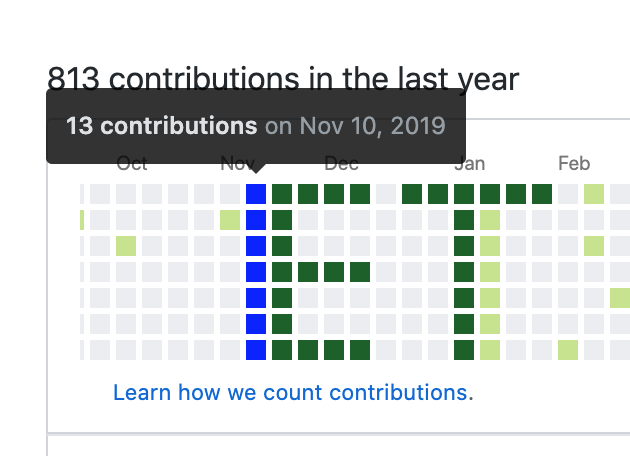

Do you have lots of white spaces in your Github activity and would you like to fill them with something interesting like [pixel art](https://es.wikipedia.org/wiki/Pixel_art)?. Then this article is for you.

## What you will learn here?

* How to create commits in past 🤯
* How to use the `Date.toLocaleDateString` method.
* How to play with regular expressions
* How to fill those boring and white Github spaces in your activity. 😏

## How to create commits in past 🤯

Okay, I think this is maybe the most important thing in this article 😅, given that it was the main question I made me when I've decided to fill out my white spaces in Github.

1. Here you will find a [short answer in StackOverflow](https://stackoverflow.com/questions/23609991/git-github-commit-at-past-date/34639957).
2. The long answer is: You need to create a commit adding the date when the commit happened. For more information, please review the [Git documentation](https://git-scm.com/docs/git-commit).
 
```
git commit --amend --no-edit --date="Fri Nov 6 20:00:00 2015 -0600"

// Explanation
git commit  // Record changes to the repository 
  --amend   // Replace the tip of the current branch by creating a new commit.
  --no-edit  // Use the selected commit message without launching an editor
  --date="Fri Nov 6 20:00:00 2015 -0600" // ⭐️ Override the author date used in the commit.
```


## How to format the days?

Well, once you know how to create a commit in pass we need to create the correct format for the amount of commits we want. (Are we developers, aren't we? and we like to save time).
In order to avoid extract every part of the date and create boring code repetitions, we can use the power of 💪🏼 built-in functions, like [toLocaleDateString](https://developer.mozilla.org/es/docs/Web/JavaScript/Referencia/Objetos_globales/Date/toLocaleDateString). This function allows to create a formatted date (in String), just passing an [object with the options](https://tc39.es/ecma402/#datetimeformat-objects).    

Once formatted the day as we want, the format is not 100% equals to our desired date in the git commit  command. So we need to replace a couple of things.
So that, we can use the [String.replace](https://developer.mozilla.org/es/docs/Web/JavaScript/Referencia/Objetos_globales/String/replace) function and the power of regular expressions 💛 and as we are developers and we like the fancy things, we can also use the [String.concat](https://developer.mozilla.org/es/docs/Web/JavaScript/Referencia/Objetos_globales/String/concat) function, in order to create immutable strings 😏

On Internet you can find some pages to play with your regular expressions like [regexr.com](https://regexr.com/) and [Rubular](https://rubular.com/). Enjoy them!
  

```javascript
const getFormattedDay = (stringDate) => {
	const date = new Date(stringDate);
	const options = {
	  weekday: 'short', 
	  month: 'short', 
	  day: 'numeric' ,
	  hour: '2-digit',
	  minute: '2-digit',
	  second: '2-digit',
	  year: 'numeric', 
	};
	const dateFormatted = date.toLocaleDateString('en-US', options);

	return dateFormatted
		.replace(/,/ig, '')
		.replace(/\d\d\d\d /i, '')
		.replace(/PM|AM/ig, '')
		.concat(date.getFullYear())
		.concat(' -0500');
}

```

## How to generate the commit text based on the desired days?



Alright! so far, we have done many things (I guess) so, only it is remaining to paint the Github Activity. To paint our grid we need to know the next things. 
1. The height of the grid is 7 rects/squares.
2. Review in the Github Activity the days we want to mark.
3. An array with all dates we want to mark.


```javascript
const getCommitText = (days) => {
	return days.map(day => `git commit --amend --no-edit --date="${getFormattedDay(day)}"` 
	+ ` && git push origin master --force`);
};

const letterE = [
// Top stick letter E
'2019-11-17 20:00',
'2019-11-24 20:00',
'2019-12-01 20:00',
'2019-12-08 20:00',
// Bottom stick letter E
'2019-11-23 20:00',
'2019-11-30 20:00',
'2019-12-07 20:00',
'2019-12-14 20:00',
// Left stick letter E
'2019-11-10 20:00',
'2019-11-11 20:00',
'2019-11-12 20:00',
'2019-11-13 20:00',
'2019-11-14 20:00',
'2019-11-15 20:00',
'2019-11-16 20:00',
'2019-11-18 20:00',
'2019-11-19 20:00',
'2019-11-20 20:00',
'2019-11-21 20:00',
'2019-11-22 20:00',
// Middle stick letter E
'2019-11-27 20:00',
'2019-12-04 20:00',
'2019-12-11 20:00'
];

const letterT = [
// Top stick letter T
'2019-12-22 20:00',
'2019-12-29 20:00',
'2020-01-05 20:00',
'2020-01-12 20:00',
'2020-01-19 20:00',
'2020-01-26 20:00',
// Middle stick letter T
'2020-01-06 20:00',
'2020-01-07 20:00',
'2020-01-08 20:00',
'2020-01-09 20:00',
'2020-01-10 20:00',
'2020-01-11 20:00',
'2020-01-13 20:00',
'2020-01-14 20:00',
'2020-01-15 20:00',
'2020-01-16 20:00',
'2020-01-17 20:00',
'2020-01-18 20:00',
];

// Magic happends here
getCommitText(letterE).join('\n\r');
getCommitText(letterT).join('\n\r');
```

## Creating the commits 

Congratulations! 🙌🏼 now you can run this commits in your empty repo created in Github and play with the white spaces in your Github Activity.

```shell script
git commit --amend --no-edit --date="Sun Dec 22 08:00:00 2019 -0500" && git push origin master --force                                                                      ─╯
git commit --amend --no-edit --date="Sun Dec 29 08:00:00 2019 -0500" && git push origin master --force
git commit --amend --no-edit --date="Sun Jan 5 08:00:00 2020 -0500" && git push origin master --force
git commit --amend --no-edit --date="Sun Jan 12 08:00:00 2020 -0500" && git push origin master --force
git commit --amend --no-edit --date="Sun Jan 19 08:00:00 2020 -0500" && git push origin master --force
git commit --amend --no-edit --date="Sun Jan 26 08:00:00 2020 -0500" && git push origin master --force
git commit --amend --no-edit --date="Mon Jan 6 08:00:00 2020 -0500" && git push origin master --force
git commit --amend --no-edit --date="Tue Jan 7 08:00:00 2020 -0500" && git push origin master --force
git commit --amend --no-edit --date="Wed Jan 8 08:00:00 2020 -0500" && git push origin master --force
git commit --amend --no-edit --date="Thu Jan 9 08:00:00 2020 -0500" && git push origin master --force
git commit --amend --no-edit --date="Fri Jan 10 08:00:00 2020 -0500" && git push origin master --force
git commit --amend --no-edit --date="Sat Jan 11 08:00:00 2020 -0500" && git push origin master --force
```

 

> Finally, don't forget "With a great power comes a great responsibility".

## Shut up! and show me the code. 

Okay my dear friend. [Here you will find my Gist](https://gist.github.com/codesandtags/6dc67efd0a968a080b3c2c6038c8a2e1) ♥️ . I hope you can fill those horrible white spaces in your Github Activity and create awesome pixel arts. [Here some ideas](https://www.shutterstock.com/es/search/geek+pixel?image_type=illustration) for you.  

Cheers and keep learning! 🍻