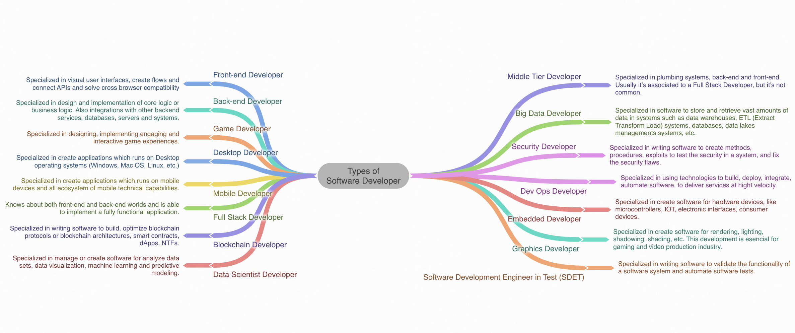

Did you know the term Software Developer is too general to describe what does a Software Developer nowadays?.
Well, here I've created the next mind map to let you know the big picture about the different types of Software Developers you can find in the industry.

Here you can find the full version of the mind map. [Types of Software Developer](https://coggle.it/diagram/YjYZFFhHPaPgcitQ/t/-)

## Types of Software Developers

- Front-end Developer
- Back-end Developer
- Game Developer
- Desktop Developer
- Mobile Developer
- Full Stack Developer
- Blockchain Developer
- Data Scientist Developer
- Middle Tier Developer
- Big Data Developer
- Security Developer
- Dev Ops Developer
- Embedded Developer
- Graphics Developer
- Software Development Engineer in Test (SDET)

