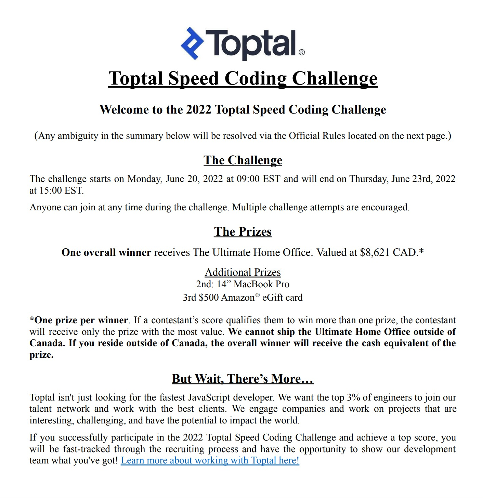
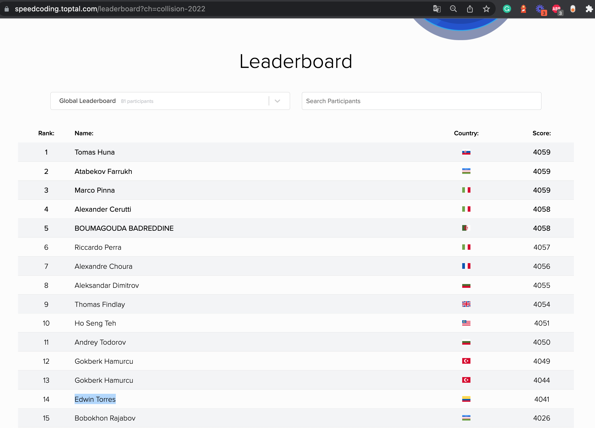

## ¿Cómo abordé un reto de Speed Coding creado por Toptal?

Hace unos días estuve en el [CollisionConf](https://collisionconf.com/) *(Collision is one of the world’s biggest tech conferences)*, donde participaron muchas startups, vinieron speakers de talla mundial, habían inversores buscando oportunidades, CEO/CTO/Directores/Estudiantes con una historia y muchas ganas de aprender.

Justo faltando un día para que acabara el evento, me encontré en un stand de la empresa Toptal, donde estaba ofreciendo un premio por ganar la mayor cantidad de puntos en una competencia de Speed Coding. Jamás había escuchado de esto, y como la competencia era en JavaScript, me emocioné y decidí participar.

## ¿Cómo era la prueba?

La prueba consistia en resolver en menos de 3 minutos (apróximadamente) unos `15 ejercicios de programación` en Javascript, los cuales salían de forma aleatoria, empezando por los fáciles y terminando por el que más complejidad tenía. La interfaz gráfica usaba [Ace Editor](https://ace.c9.io/)  para ingresar el código esperado, ejecutar los Unit Test y enviar la solución.

Por cada ejercicio solucionado te dan una serie de puntos, y también dependiendo la cantidad de segundos que te sobren te van dando una bonificación.

## Primera estrategia - Copiando y Pegando

Dado que era mi primer acercamiento al Speed Coding, abordé el tema como todo un novato, empecé a familiarizarme con la interfaz gráfica, fue explorando los ejercicios que tenían, y empecé a guardar las preguntas para solucionarlas una a una con más tiempo.  Una vez tenía todas las preguntas y respuestas, decidí empezar a copiar y pegar las respuestas (ya que es imposible escribir ese código manualmente en ese tiempo). 

Haciendo esto llegué a ganar alrededor de unos `300 puntos`, (sin embargo los primeros lugares tenían un poco más de `4000 puntos`). En ese momento supe que no era la mejor estrategia y tenia que buscar algo más efectivo.

## Segunda estrategia - Automatizando envios en la interfaz gráfica

Dado que ya había tenido automatizando flujos en Javascript (En propio navegador usando SetInterval y SetTimeout) y usando algunas herramientas como Selenium o Puppeteer, decidí escoger una de estas.

En este punto hice varias cosas como:
1. Identifiqué los selectores del botón enviar.
2. Minifiqué y pasé todas las soluciones de JavaScript a un objeto (Map) para identificarlas con el nombre del problema y obtener la solución
3. Use una expresión regular para identificar en los selectores cuál era el nombre del problema a resolver.
4. Moví el cursor a la primera línea para poner ahí el código de la solución.
5. Simulaba un click sobre botón Submit que ejecutaba las pruebas.
6. Simulaba un click sobre botón Submit para enviar el ejercicio y moverme al siguiente hasta terminar.

[Ver código fuente - speed-coding.js](https://github.com/codesandtags/speed-coding/blob/main/src/toptal/speed-coding.js)

Esta estrategia me permitió subir a un puntaje apróximadamente de unos `1,500` puntos.

## Tercera estrategia - Haciendo peticiones directamente al API

No podía quedarme con la duda, de como abordar mejor este problema así que encontré un articulo creado por Toptal - [Coding Challenge Retrospective](https://www.toptal.com/javascript/coding-challenge-retrospective), el cuál me dió una nueva idea y es que en vez de gastar tiempo en la interfaz gráfica, podría reducir significativamente el tiempo haciendo peticiones directamente en el API. De esta manera vi algunos ejemplos que mostraban en el articulo y decidí adaptarlo a mi manera.

En este punto realicé las siguientes cosas:
1. Identifiqué en el navegador la forma en que el API hacia las peticiones (eran peticionces POST usando un form-data).
2. Creé una función para iniciar el challenge y otra que de manera recursiva empezaba a enviar soluciones hasta que el isChallengeEntryFinished fuera verdadero.
3. Me dí cuenta que lo más importante en el API era enviar en sus datos las respuestas de los test con el valor correcto, y esto significaba que tenía que ejecutar localmente las validaciones con mis funciones generadas para cada problema.
4. En este punto lo más retante fue identificar la mejor forma de ejecutar las funciones con parámetros variables y ajustar el formato de la respuesta en la petición, como por ejemplo los test_cases y el code.

[Ver código fuente - speed-coding-api.js](https://github.com/codesandtags/speed-coding/blob/main/src/toptal/speed-coding-api.js)

Esta estrategia me permitió subir a un puntaje apróximado de  `3928` puntos.

Luego de esto, hice algunas optimizaciones en el código, llegando finalmente a un puntaje de `4041` puntos, quedando en el puesto `14` de la competencia, quedando a unos `18` puntos del primer puesto.

## Conclusión

Después de invertir al menos unas **6 horas** 😅 de la madrugada en este reto, tuve una grata experiencia y disfruté demasiado poder abordar diferentes soluciones, aprendí cosas sobre como mejorar el performance y está claramente que jugando directamente con el API hace una reducción bastante grande en el tiempo, ya que la interfaz gráfica en su renderización, quita milisegundos valiosos.

Para un futuro, probablemente abordaré la estrategia 1 y 3, adicionandole un valor agregado con la implementación de [multiples threads en Nodejs](https://www.geeksforgeeks.org/how-to-handle-child-threads-in-node-js/), e incluso contemplando el uso otros lenguajes de programación como Go. 

